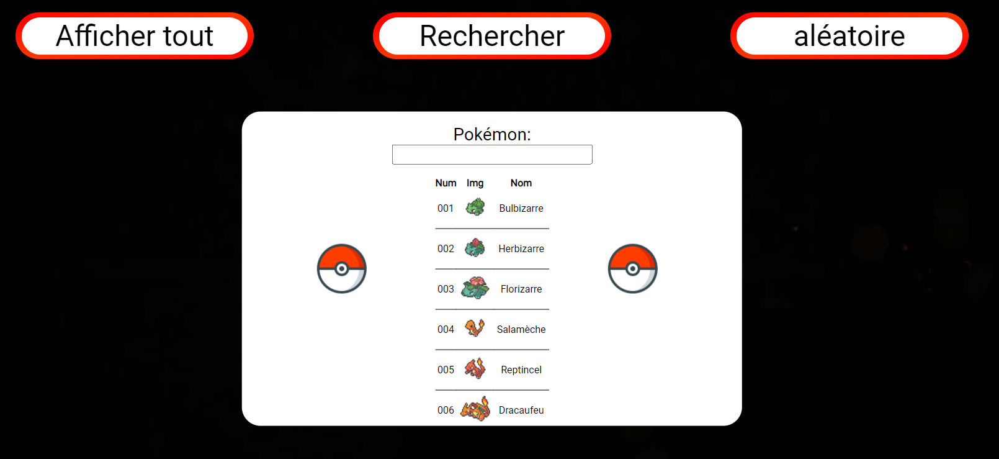

# FR: PokéDex Viewer

Bienvenue sur le PokéDex Viewer, une application web simple qui vous permet d'explorer les 151 premiers Pokémon de la première génération. Cette application a été créée en utilisant une API Node.js.

## Fonctionnalités

### 1. **Affichage de tous les Pokémon** : 

### 2. **Recherche de Pokémon** : 

### 3. **Affichage aléatoire** : 

## Installation

1. npm install fs

2. npm install express

3. npm install cors

4. node .\server_pokedex.js

5. Ouvrez votre navigateur et accédez à http://127.0.0.1:5001 pour l'API explorer le PokéDex Viewer.

6. Ouvrez votre index.html avec votre navigateur pour explorer le PokéDex Viewer.

## Annexe

### Cartes pokémon
[https://tcg.pokemon.com/fr-fr/galleries/151/](https://tcg.pokemon.com/fr-fr/galleries/151/)

### données pokédex
[https://github.com/fanzeyi/pokemon.json/tree/master](https://github.com/fanzeyi/pokemon.json/tree/master)

### idée
[https://github.com/LiliwoL/Node-API-Pokedex](https://github.com/LiliwoL/Node-API-Pokedex)

# Info
Ce dépôt a été créé par moi-même. Il s'agit à la fois d'un exercice et d'une passion pour moi de travailler sur de tels projets. En développant ce projet, mon intention est de ne causer aucun préjudice ni dommage à qui que ce soit. Si vous rencontrez le moindre problème ou avez des préoccupations, je vous encourage vivement à me contacter à l'adresse e-mail suivante : johanvadenne@gmail.com. Mon objectif est de garantir une expérience positive et respectueuse pour tous les utilisateurs de ce projet.

# EN: PokéDex Viewer

Welcome to the PokéDex Viewer, a simple web application that lets you explore the first 151 first-generation Pokémon. This application was created using a Node.js API.

## Features

### 1. **Display all Pokémon** : 

### 2. **Search for Pokémon** : 

### 3. **Random display** : 

## Installation

1. npm install fs

2. npm install express

3. npm install cors

4. node .\server.js

5. Open your browser and go to http://127.0.0.1:5001 to explore the PokéDex Viewer API.

6. Open index.html with your browser for explore the PokéDex Viewer.

## Appendix

### Pokémon cards
[https://tcg.pokemon.com/fr-fr/galleries/151/](https://tcg.pokemon.com/fr-fr/galleries/151/)

### pokédex data
[https://github.com/fanzeyi/pokemon.json/tree/master](https://github.com/fanzeyi/pokemon.json/tree/master)

### idea
[https://github.com/LiliwoL/Node-API-Pokedex](https://github.com/LiliwoL/Node-API-Pokedex)

# Info
This repository was created by myself. It is both an exercise and a passion for me to work on such projects. In developing this project, my intention is not to cause any harm or damage to anyone. If you encounter any problems or have any concerns, I strongly encourage you to contact me at the following e-mail address: johanvadenne@gmail.com. My goal is to ensure a positive and respectful experience for all users of this project.
